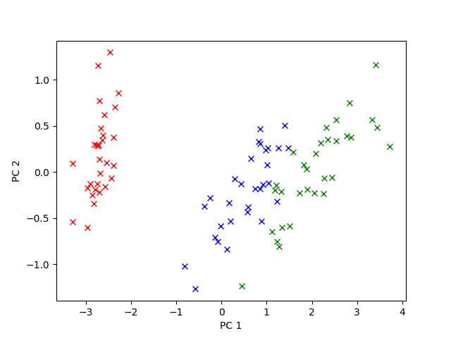

# Flowers-Recognition
A small machine learning project in python that helps to classify a flower based on 4 features into one of the three categories(Supervised learning classification)
In this project we process our data and then feed them on three famous unsupervised algorithms mainly Gaussian Naive Bayes, Support Vector
machine , Decision tree and everytime after doing some preprocessing on the data we record our observation of the data on each algorithm
<strong><h1> Simply Extracting the Data </h1><strong> 
  <h3> First_script.py </h3>
  In this script we simply load the data from data_set.txt extract our data and then seperate the features from the labels
  then we split our data in 60:40 ratio for training and testing set respectively and simply feed the data into Support Vector Machine 
  GaussianNB and Decision tree we get the following metrics we sure sklearn.metrics module to get these data 
<table>
  <caption> Observation </caption>
  <tr>
    <td>
      Parameter
    </td>
    <td>
      Support vector Machine
    </td>
    <td>
      Gaussian Naive Bayes
    </td>
    <td>
      Decision tree Classifier
    </td>  
  </tr>   
  <tr>
    <td>
      Accuracy_Score
    </td>
    <td>
      0.966666666667
    </td>
    <td>
      0.966666666667
    </td>
    <td>
      0.966666666667
    </td>  
  </tr>  
</table>  
<strong><h1> Applying PCA on data </h1><strong> 
  <h3> First_script.py </h3>
  
In this script we simply load the data from data_set.txt extract our data and then seperate the features from the labels
  unlike previous step this time we convert our 4 feature data into a 2 feature using PCA and then we visualize our data
  then we split our data in 60:40 ratio for training and testing set respectively and simply feed the data into Support Vector Machine 
  GaussianNB and Decision tree we get the following metrics we sure sklearn.metrics module to get these data 

  
  

	
	<h5> Scatter plot with newly modified features from PCA </h5>
  

  
<table>
  <caption> Observation </caption>
  <tr>
    <td>
      Parameter
    </td>
    <td>
      Support vector Machine
    </td>
    <td>
      Gaussian Naive Bayes
    </td>
    <td>
      Decision tree Classifier
    </td>  
  </tr>   
  <tr>
    <td>
      Accuracy_Score
    </td>
    <td>
      0.966666666667
    </td>
    <td>
      0.916666666667
    </td>
    <td>
      0.966666666667
    </td>  
  </tr>  
</table>  
